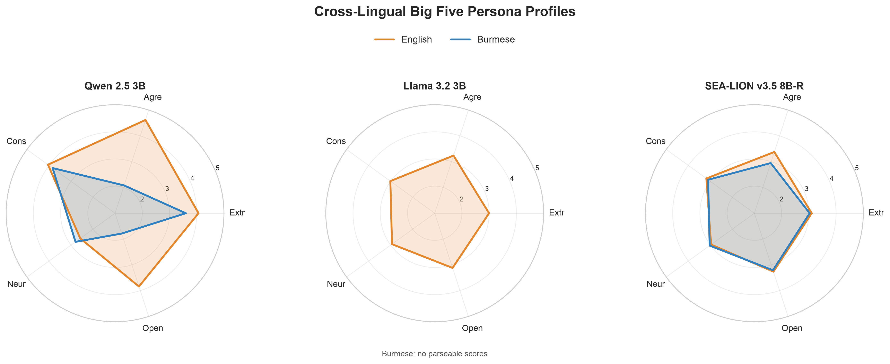
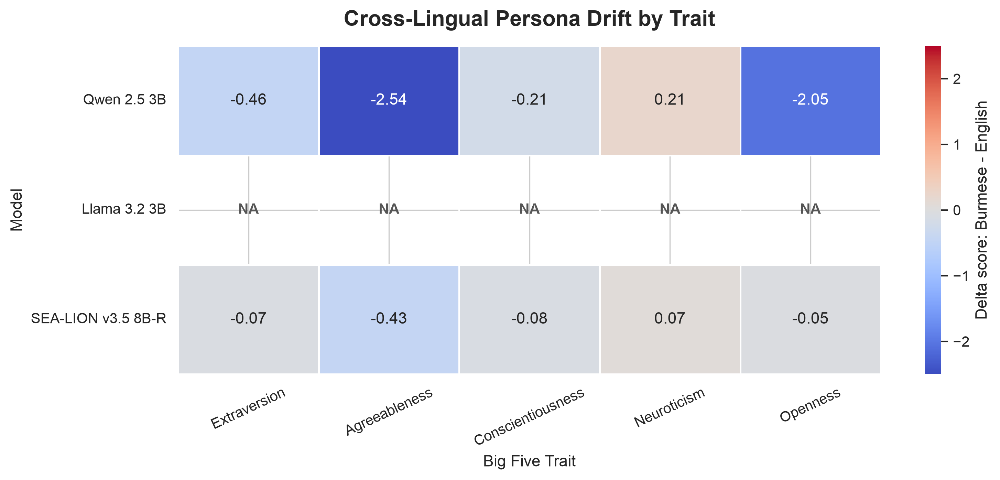
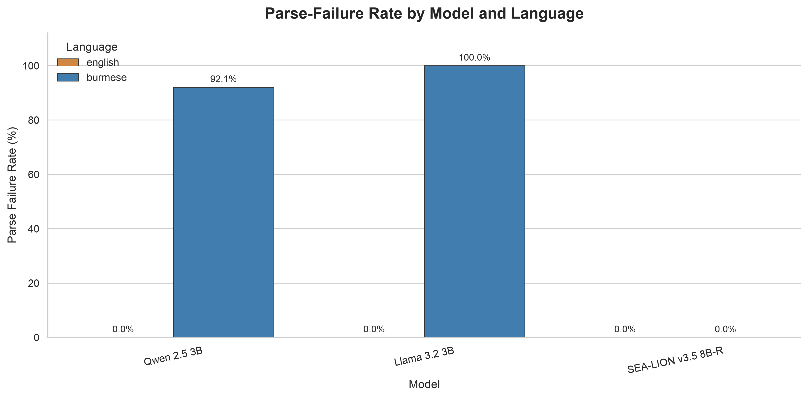

# Cross-Lingual Persona Stability in Small Language Models

An independent internship research project investigating whether small language
models express consistent Big Five personality profiles when the same IPIP-50
questionnaire is administered in English and Burmese.

The repository contains the bilingual questionnaire, a reproducible local
evaluation pipeline, 6,000 item-level responses from three open models, scoring
and visualization code, and the resulting research figures.

> This project evaluates pretrained language models; it does not fine-tune them.
> The reported scores describe model responses to a questionnaire, not human
> personality or clinical measurements.

## Research question

Does changing only the questionnaire language change a small language model's
apparent Big Five profile or its ability to follow the requested response format?

## Experiment design

| Component | Setting |
| --- | --- |
| Instrument | IPIP-50 Big Five questionnaire |
| Languages | English and Burmese |
| Models | Qwen 2.5 3B, Llama 3.2 3B, SEA-LION v3.5 8B-R |
| Repeated sessions | 20 per model-language pair |
| Items per session | 50 |
| Total generations | 6,000 |
| Response scale | Integer from 1 (very inaccurate) to 5 (very accurate) |
| Sampling | Temperature 0.7, maximum 8 generated tokens |
| Inference | Stateless generation through Ollama |

Each response is stored with its model, language, session, questionnaire item,
trait, keying direction, raw output, and parsed score. Negatively keyed items are
reverse-scored before the ten items for each trait are averaged. Session-level
scores are then summarized using the mean and sample standard deviation.

## Main findings

Response-format reliability differed sharply in Burmese:

| Model | English parse failures | Burmese parse failures |
| --- | ---: | ---: |
| Qwen 2.5 3B | 0 / 1,000 (0.0%) | 921 / 1,000 (92.1%) |
| Llama 3.2 3B | 0 / 1,000 (0.0%) | 1,000 / 1,000 (100.0%) |
| SEA-LION v3.5 8B-R | 0 / 1,000 (0.0%) | 0 / 1,000 (0.0%) |

SEA-LION was the only model with complete, parseable data in both languages. Its
mean absolute English-Burmese trait difference was **0.14 points** on the 1-5
scale. Its largest shift was Agreeableness, which was 0.43 points lower in
Burmese.

The Burmese Qwen profile is based on only 79 parseable item responses and the
Llama Burmese profile has no parseable responses. Their cross-language trait
comparisons should therefore not be interpreted as reliable persona drift. This
failure is itself an important result: instruction following and output-format
compliance can break before psychometric comparison is possible.







## Repository contents

| Path | Purpose |
| --- | --- |
| `ipip-50_english.json` | English IPIP-50 items and scoring keys |
| `ipip-50_burmese.json` | Parallel Burmese IPIP-50 items and scoring keys |
| `llm_pipeline.py` | Resumable Ollama evaluation over all models and sessions |
| `analyze_results.py` | Reverse scoring, session aggregation, summaries, and bar chart |
| `visualize_persona_results.py` | Radar, language-drift, and parse-failure figures |
| `llm_persona_results.csv` | Raw item-level outputs for all 6,000 generations |
| `llm_persona_trait_scores.csv` | Big Five scores by model, language, and session |
| `llm_persona_summary.csv` | Aggregate trait means, standard deviations, and sample counts |
| `kaggle_one_model_eval_and_visualize.py` | GPU-ready Hugging Face runner for one model at a time |
| `qwen-7b-ipip-eval.ipynb` | Executed Kaggle experiment for Qwen 2.5 7B Instruct |

## Run the analysis

Python 3.10 or newer is recommended.

```bash
python -m venv .venv
source .venv/bin/activate
pip install -r requirements.txt

python analyze_results.py
python visualize_persona_results.py
```

These commands rebuild the summary CSV files and all figures from the included
item-level results. Model inference is not required for this step.

## Run the full local evaluation

Install and start [Ollama](https://ollama.com/), then download the configured
models:

```bash
ollama pull qwen2.5:3b
ollama pull llama3.2:3b
ollama pull aisingapore/Llama-SEA-LION-v3.5-8B-R
python llm_pipeline.py
```

The pipeline writes each generation immediately and resumes completed sessions
after interruption. Model names, session count, generation settings, input files,
and output path are configurable near the top of `llm_pipeline.py`.

Because the repository includes a completed results file, the pipeline will
detect those sessions and skip them. To collect a fresh run, first archive the
included `llm_persona_results.csv` under a different name or configure a new
output path.

## Kaggle / Hugging Face runner

The Kaggle script loads one Hugging Face model in 4-bit quantization, validates
strict one-character responses, creates model-specific outputs, and can remove
the downloaded model cache after completion. The default model is
`Qwen/Qwen2.5-7B-Instruct`; select another model with `TARGET_MODEL`:

```bash
TARGET_MODEL=Qwen/Qwen2.5-7B-Instruct \
python kaggle_one_model_eval_and_visualize.py
```

On Kaggle, attach the two questionnaire JSON files as input data, enable a GPU
and internet access, and add `HF_TOKEN` as a Kaggle secret if the selected model
requires authentication.

## Limitations

- The experiment measures prompted model behavior, not a stable internal
  personality.
- High parse-failure rates can make trait aggregates sparse or unusable.
- The models differ in size and language specialization, so this is not a
  controlled architecture comparison.
- Prompt wording and translation choices may affect measured differences.
- Results come from one questionnaire, one sampling configuration, and 20
  sessions per condition; they should not be generalized beyond this setup.

## Project context

I independently designed and implemented this research during my internship,
including the English-Burmese evaluation setup, inference pipeline, psychometric
scoring workflow, reliability checks, analysis, and visualizations.
